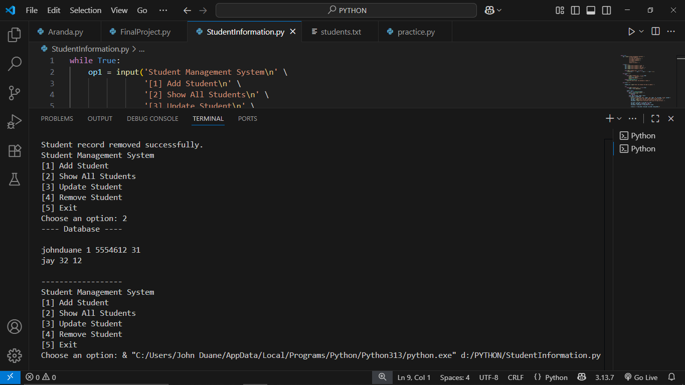
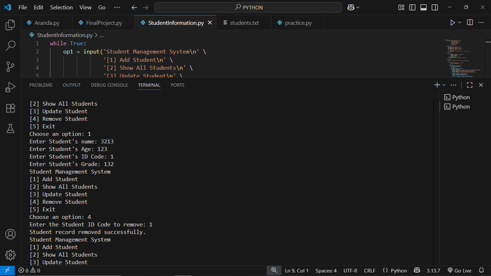

Student Management System

This project is a simple student management system in Python.

THE PYTHON FILE
[StudentsInformation.py](StudentsInformation.py)

Features
- Add student
- Show all students
- Update student
- Remove student
- Save records to `students.txt` 

Files
- `StudentInformation.py` - main program
- `students.txt` - stores student records
- `Sample1.PNG`, `Sample2.PNG` - screenshots
- `README.md` - project documentation

ScreenShots

RUNNING THE PROGRAM

THE .txt FILE

[students.txt](students.txt)

